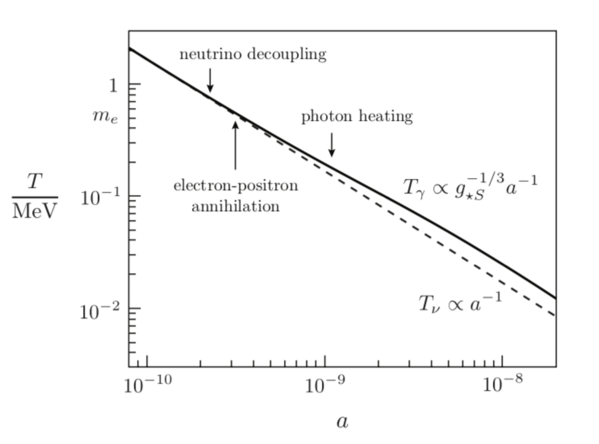

# Neutrino Temperature

## Explain why the neutrino temperature is different from the CMB temperature and estimate it.

As we can see from this plot, the main reason why $T_{CMB} \neq T_\nu$ is because neutrinos decouple at a temperature of $1MeV$, which happens before electron-positron annihilation stops. This means that once the photon temperature decreases such that electron-positron pair production is no longer possible, these particles annihilate each other and dump their energy into the photon bath, giving it a boost. Since neutrinos are already decoupled, they don't recieve this boost in temperature.

The way to get an estimate for $T_\nu$ is by taking into consideration the specific entropy of the neutrinos and the photons for a time $t_1$ before neutrino decoupling and a time $t_2$ after electron-positron annihilation happens. The relationship between the specific entropy and temperature is given by:

$$
s \propto g_{*S}(T) T^3
$$

Remember that $sa^3 = \textit{constant}$. Invoking this for the photons at the two different times gives us:

$$
g_{*S}(T_{\gamma,1}) a_1^3 T_{\gamma,1}^3 = g_{*S}(T_{\gamma,2}) a_1^3 T_{\gamma,2}^3
$$

For $g_{*S}(T_{\gamma,1})$ we include photons, electrons, positrons and neutrinos all at the same temperature, and for $g_{*S}(T_{\gamma,2})$ we only take into account photons and neutrinos. Simplifying, this leaves us with:

$$
(a_1 T_{\gamma,1})^3 \bigg( 2 + \frac{7}{4} (2 + N_\nu g_\nu) \bigg) = (a_2 T_{\gamma,2})^3 \bigg( 2 + \frac{7}{4} (N_\nu g_\nu) \bigg(\frac{T_{\nu,2}}{T_{\gamma,2}}\bigg)^3\bigg)
$$

We want to relate $T_{\nu,1}$ and $T_{\gamma,2}$. For that, we now apply the same conservation rule but focusing only on the neutrinos, sarting right after they decouple:

$$
s_\nu \propto T_\nu^3 \implies T_{\nu,1}^3 a_1^3 = T_{\nu,2}^3 a_2^3
$$
$$
\implies T_{\nu,2} = \frac{a_1}{a_2}T_{\nu,1}
$$

Since right after decoupling the neutrino and photon temperatures are the same, we can say that

$$
T_{\nu,2} = \frac{a_1}{a_2}T_{\gamma,1}
$$

We can plug this into our larger expression and get our final result:

$$
\frac{T_{\nu,2}}{T_{\gamma,2}} = \frac{T_{\nu}}{T_{\gamma}}  = \bigg( \frac{4}{11} \bigg)^{1/3}
$$

Using $T_{\gamma,0} = 2.73 K$ gives us today's neutrino temperature:

$$
T_{\nu,0} = 1.95 K
$$
